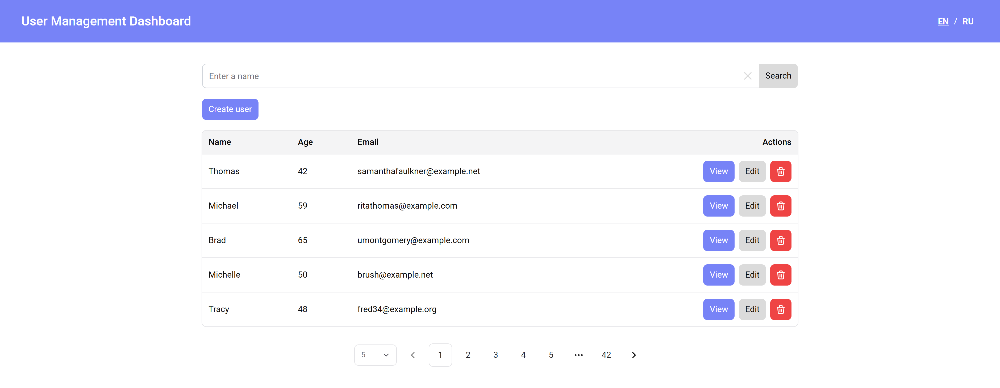
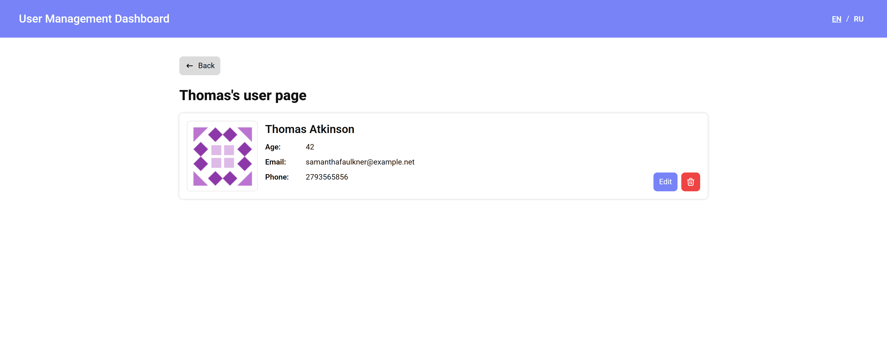
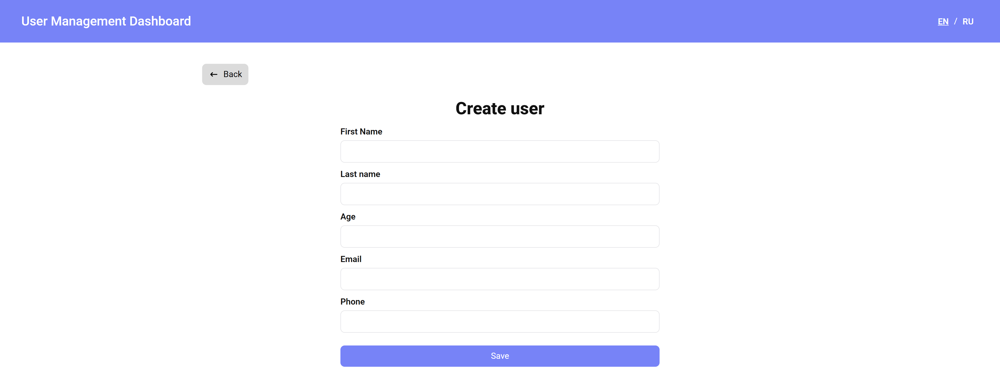
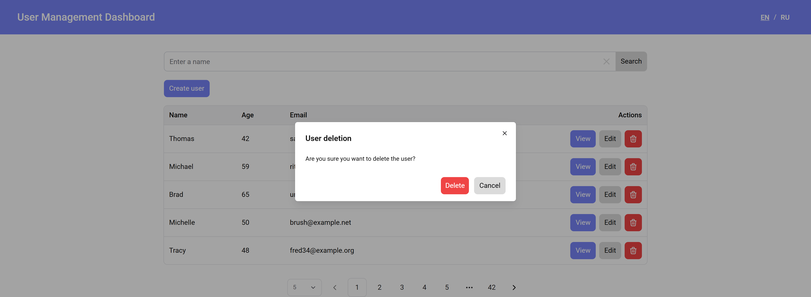
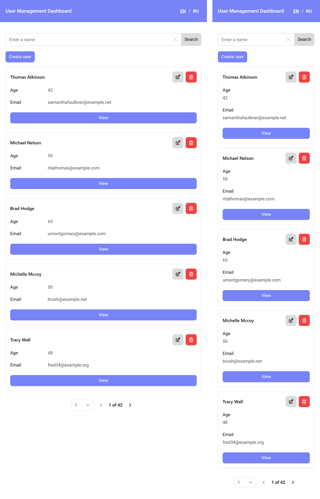
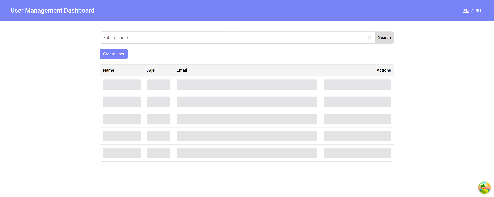
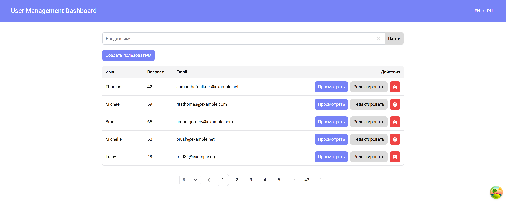

# User Management Dashboard

Учебный проект для закрепления навыков разработки на React.

Приложение позволяет управлять списком пользователей: просматривать, искать, создавать, редактировать и удалять записи. Данные загружаются с REST API, кэшируются с помощью React Query и автоматически обновляются после изменений.

## Демо

* GitHub Pages: https://leoleeeeen.github.io/user-management-dashboard/

## Возможности

* Просмотр списка и карточки пользователя
* CRUD-операции
* Поиск пользователей
* Пагинация и выбор количества записей на странице
* Валидация форм
* Подтверждение удаления
* Toast-уведомления
* Переключение языка (Русский / English)
* Skeleton, Spinner и Empty State
* Адаптивный интерфейс (таблица автоматически преобразуется в карточки на мобильных устройствах)
* Централизованная обработка ошибок

## Технологии

* React
* TypeScript
* Vite
* React Router
* React Query
* Axios
* React Hook Form
* Chakra UI
* i18next
* Feature-Sliced Design (FSD)
* ESLint
* Husky
* GitHub Actions

## Особенности реализации

* Архитектура Feature-Sliced Design
* Переиспользуемые компоненты, формы, toast-уведомления и кастомные хуки
* Кэширование запросов и автоматическая инвалидизация после изменений
* Обработка состояний загрузки и сетевых ошибок
* Автоматический деплой на GitHub Pages через GitHub Actions

## Скриншоты

### Главный экран

### Страница пользователя

### Страница создания пользователя

### Подтверждение удаления пользователя

### Адаптив на tablet/mobile

### Состояние загрузки Skeleton

### Смена языка

